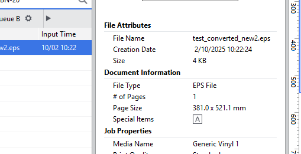

# SVG/EPS to Roland Versaworks Converter

This program converts SVG or EPS files to Roland Versaworks-compatible format with proper CutContour spot color support. It separates cut paths from print content when processing SVG files with designated cut layers.

Useful for using a Roland plotter to create engineering prototypes (like FreeCAD sketch/Sheet Metal Workbench exports) as well as custom decals. All with FOSS, no Illustrator nor CorelDRAW needed.

## Quick Usage
Name layers with 'cut' in the name


Then run the script:
```bash
python eps_to_versaworks.py design.svg
```

This will produce `design_versaworks.eps` with cut paths saved:



### Layer Naming

The cut layer can be named (case-insensitive):
- `id="cut"` ✓
- `id="Cut"` ✓
- `id="CUT"` ✓
- `id="cut-contour"` ✓
- `id="cutting-lines"` ✓
- `inkscape:label="Cut Layer"` ✓
- `inkscape:label="cut"` ✓

or if manually specified:
```xml
<svg>
  <g id="artwork">
    <!-- Colors, text, fills - stays as print -->
  </g>
  
  <g id="cut">
    <!-- Outlines - becomes CutContour -->
  </g>
</svg>
```

## The Problem

When exporting EPS files from Inkscape or other design software, spot colors are not preserved. Roland Versaworks requires cut contour lines to be defined as a specific spot color called "CutContour" with CMYK values of 0,100,0,0 (100% Magenta).

### Solution

This Python program:
1. **Detects cut layers** in SVG files (groups/layers with "cut" in their name)
2. **Separates processing**: Cut layer → CutContour spot color, Print content → preserved as-is
3. **Adds spot color definitions** to the EPS header using PostScript Level 2 standards
4. **Applies CutContour** only to designated cut paths
5. **Merges layers** maintaining perfect alignment
6. **Validates output** with Ghostscript
7. **Sets hairline width** (0.25 points) as required by Roland specifications

## Usage documentation

### For SVG with Cut Layer

```bash
# Without cut layers - Convert everything to cut (ignore layers)
python eps_to_versaworks.py input.svg --convert-everything-to-cut-path

# SVG with custom output
python eps_to_versaworks.py input.svg -o output.eps

# EPS input to cut path
python eps_to_versaworks.py input.eps

# Custom stroke width
python eps_to_versaworks.py input.svg -w 0.5
```

CLI Docs:
```
python eps_to_versaworks.py input.svg [options]

Positional arguments:
  input                 Input SVG or EPS file

Options:
  -o OUTPUT             Output EPS file (default: input_versaworks.eps)
  -w STROKE_WIDTH       Stroke width in points (default: 0.25)
  --convert-everything-to-cut-path
                        Convert all paths to cut, ignoring layer separation
  -h, --help           Show help message
  -v, --version        Show version number
```

## Requirements

- **Python 3.6 or higher** - tested with `3.12`
- **Inkscape** (for SVG conversion) - must be installed and accessible. Tested: `v1.4.2`
- **Ghostscript (gs)** (optional, for validation)
- No additional Python dependencies (uses only standard library)

## License
unilicense.org